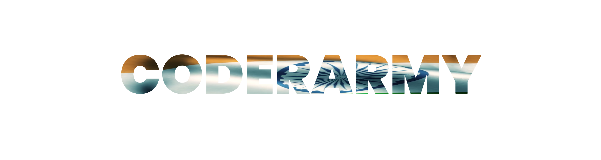

# Coder Army - Educational Platform



A modern, responsive educational platform for programming courses and coding bootcamps. This project showcases a feature-rich website for "Coder Army" with interactive UI elements, animations, and a user-friendly interface.

## 📋 Table of Contents

- [Features](#features)
- [Tech Stack](#tech-stack)
- [Project Structure](#project-structure)
- [Key Components](#key-components)
- [Animations & Effects](#animations--effects)
- [Responsive Design](#responsive-design)
- [Color Scheme](#color-scheme)
- [Installation](#installation)
- [Usage](#usage)
- [Future Enhancements](#future-enhancements)

## ✨ Features

- **Modern UI Design**: Sleek dark theme with purple accent colors
- **Responsive Layout**: Adapts to various screen sizes (desktop, tablet, mobile)
- **Interactive Elements**: Hover effects, animations, and transitions
- **Course Showcase**: Display of premium and free courses with details
- **Instructor Profiles**: Showcase of expert instructors with credentials
- **Contact Form**: Interactive contact section with form validation
- **Social Media Integration**: Links to social platforms with custom hover effects
- **Animated Logo**: Flag-waving effect with shimmer animation

## 🛠️ Tech Stack

- **HTML5**: Semantic markup structure
- **CSS3**: Advanced styling with:
  - CSS Variables
  - Flexbox
  - CSS Grid
  - CSS Animations
  - Media Queries
- **Font Awesome 6.4.0**: Icon library for UI enhancement

## 📁 Project Structure

```
Colone/
│
├── index.html          # Main HTML document
├── style.css           # CSS styling
├── Picture/            # Image assets folder
│   └── CoderArmyLOGO.png # Logo image
└── README.md           # Project documentation
```

## 🧩 Key Components

1. **Navigation Bar**:
   - Responsive navigation with mobile toggle
   - Active state highlighting
   - Login button with animation

2. **Hero Section**:
   - Introduction with call-to-action buttons
   - Social media links with custom hover colors
   - Code card display with syntax highlighting
   - Key statistics display

3. **Courses Section**:
   - Premium courses with interactive cards
   - Free courses with detailed information
   - Call-to-action buttons

4. **About Section**:
   - Instructor profiles with credentials
   - Social links for instructors
   - Key features of learning experience

5. **Logo Animation**:
   - Flag-waving effect
   - Shimmer animation overlay
   - Interactive hover state

6. **Contact Section**:
   - Form with styled input fields
   - Online status indicator with animation
   - Quick response notification
   - Form validation

7. **Footer**:
   - Multi-column layout
   - Quick links
   - Social media connections
   - Copyright information

## ✨ Animations & Effects

The website features several custom animations:

1. **Pulse Animation**:
   - Applied to active navigation items
   - Creates a glowing effect

2. **Logo Wave Animation**:
   - 3D perspective rotation
   - Scaling effects for realistic flag movement

3. **Flag Shimmer**:
   - Linear gradient animation
   - Creates a light reflection effect

4. **Float Animation**:
   - Applied to status indicators
   - Creates a gentle floating effect

5. **Social Links Hover**:
   - LinkedIn turns blue
   - YouTube turns red
   - Instagram turns pink

6. **Button Hover Effects**:
   - Elevation effect (translateY)
   - Shadow enhancement
   - Background color transition

## 📱 Responsive Design

The website is fully responsive with breakpoints for:

- Desktop (992px+)
- Tablet (768px to 991px)
- Mobile (481px to 767px)
- Small mobile (480px and below)

Responsive features include:

- Collapsible navigation for mobile
- Fluid typography using clamp()
- Flexible grid layouts
- Optimized spacing for smaller screens
- Adjusted animations for performance

## 🎨 Color Scheme

The project uses a dark theme with the following color palette:

- **Background Colors**:
  - Primary: #0a0a14 (Dark blue-black)
  - Secondary: #14141f (Slightly lighter dark blue)
  - Tertiary: #1e1e2d (Dark purple-blue)
  - Card background: #1a1a2f (Dark indigo)

- **Accent Colors**:
  - Primary: #9333ea (Purple)
  - Primary Light: #a855f7 (Light purple)
  - Primary Dark: #7928ca (Deep purple)
  - Secondary: #3abef8 (Light blue)

- **Functional Colors**:
  - Success: #10b981 (Green)
  - Warning: #f59e0b (Orange)
  - Danger: #ef4444 (Red)

- **Text Colors**:
  - Primary: #ffffff (White)
  - Secondary: #cbd5e1 (Light gray)
  - Tertiary: #94a3b8 (Medium gray)
  - Muted: #64748b (Dark gray)


## 💻 Usage

This project can be used as:

1. A template for educational platforms
2. A reference for modern CSS techniques
3. A showcase of interactive UI elements
4. A starting point for similar web projects


---

Created with ❤️ by [Arnab Dey] | © 2025 Coder Army